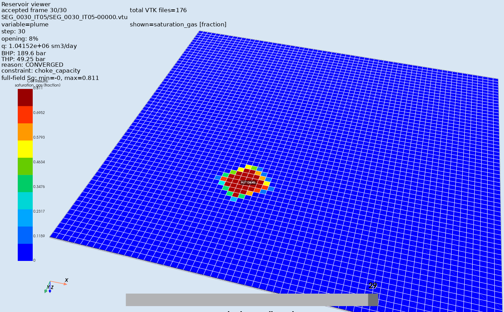
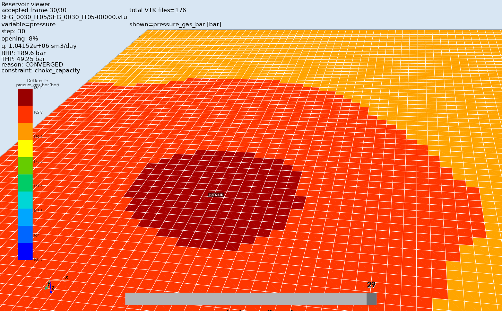
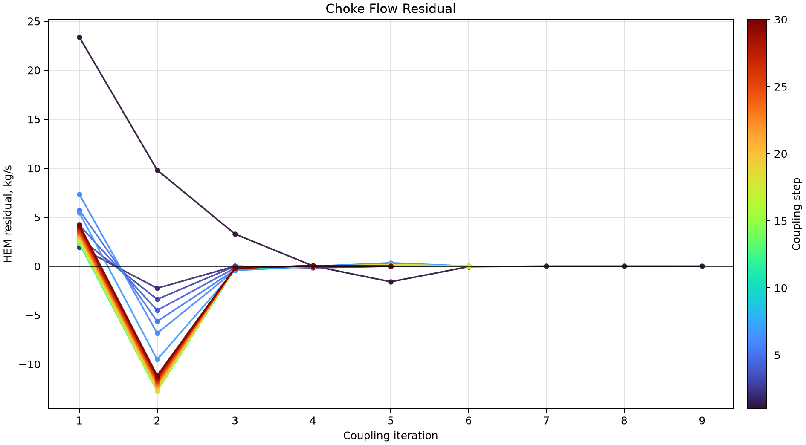
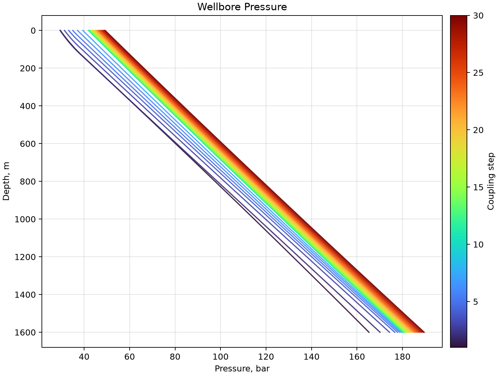
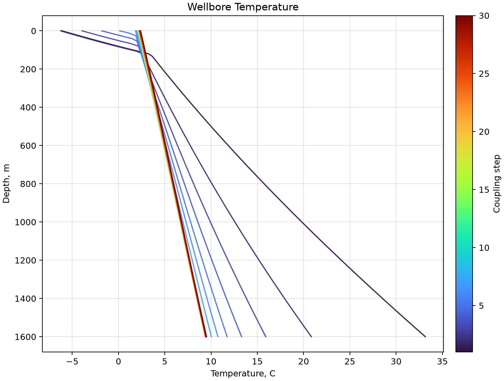

# CO₂ Wellbore–Reservoir Coupling

Coupled CO₂ injection workflow linking:

* an external CO₂ wellbore model,
* a surface choke / valve model,
* OPM Flow reservoir simulation,
* thermal coupling through `WTEMP`,
* restart-based stepwise reservoir control.

This repository contains the `v0.2.7` reliability workflow.

---

## Key features in `v0.2.7`

* HEM-based choke capacity model.
* Opening-controlled choke schedule.
* External wellbore pressure inversion.
* Thermal coupling between OPM and the wellbore:

  * `TEMPVD` remains the fixed geothermal reservoir profile.
  * `WTEMP` is updated for each coupling iteration from the calculated bottomhole temperature.
* Restart-based OPM Flow coupling with accepted-step continuation.
* PyVista viewers for reservoir VTK fields and wellbore profiles.
* Clean plotting scripts for convergence, pressure, temperature, rate and choke diagnostics.
* Canonical 30-step runner with opening schedule:
  `1, 2, 3, 4, 5, 6, 7, 8, then 8% until step 30`.

---

## Example results

### CO₂ plume / gas saturation



### Reservoir pressure field



### Choke residual convergence



### Wellbore pressure profiles



### Wellbore temperature profiles



---

## Repository structure

```text
co2-wellbore/
├── data/
│   ├── Base.DATA
│   └── INCLUDE/
├── examples/
│   ├── 07_opm_opening_choke_coupling.py
│   └── run_30step_opening_choke_vtk.sh
├── scripts/
│   ├── replot_coupling_clean.py
│   ├── view_coupled_pipe_pyvista.py
│   └── view_coupled_reservoir_pyvista.py
├── src/co2_wellbore/
│   ├── choke.py
│   ├── hem_choke.py
│   ├── properties.py
│   └── coupling/
│       ├── deck_editing.py
│       ├── opening_choke.py
│       ├── opm_restart.py
│       ├── plotting.py
│       └── reporting.py
└── figures/
```

---

## Installation

Create and activate a Python environment:

```bash
python3 -m venv .venv
source .venv/bin/activate
```

Install the package in editable mode:

```bash
pip install -e .
```

For PyVista visualization:

```bash
pip install pyvista vtk matplotlib pandas numpy
```

OPM Flow must be available as `flow` in your terminal:

```bash
flow --version
```

---

## Run the canonical 30-step coupled case

From the repository root:

```bash
./examples/run_30step_opening_choke_vtk.sh
```

Or provide a custom case ID:

```bash
./examples/run_30step_opening_choke_vtk.sh MY_30STEP_CASE
```

The canonical schedule is:

```text
1 2 3 4 5 6 7 8 8 8 8 8 8 8 8 8 8 8 8 8 8 8 8 8 8 8 8 8 8 8
```

The generated outputs are written to:

```text
data/runs_restart_coupled_coolprop_manywells/<CASE_ID>/
```

These simulation outputs are intentionally ignored by Git.

---

## Coupling model

At each coupling step, the workflow solves:

1. OPM Flow reservoir response for a trial injection rate.
2. External wellbore pressure inversion:

   ```text
   BHP_wellbore(THP, q, h_choke) = WBHP_OPM
   ```
3. HEM choke flow consistency:

   ```text
   m_actual = m_capacity_HEM(opening, P1, T1, THP)
   ```
4. Thermal consistency:

   ```text
   WTEMP_OPM = BHT_wellbore
   ```

Accepted steps are stored in:

```text
coupled_exchange_accepted.csv
```

All trial iterations are stored in:

```text
coupled_exchange_iterations.csv
```

---

## Thermal restart note

A key issue fixed in `v0.2.5` is the thermal restart behavior.

The reservoir geothermal profile is initialized by:

```text
TEMPVD
...
/
```

This must remain fixed and must not be replaced by the injected CO₂ temperature.

The coupling updates the well injection/source temperature through:

```text
WTEMP
 INJ1 <BHT_from_external_wellbore> /
/
```

Restart segments preserve the fixed `TEMPVD` profile while applying the current coupling `WTEMP`.

This prevents the whole reservoir temperature field from being incorrectly reset to the reference temperature.

---

## View reservoir cubes

Set the case directory:

```bash
CASE_ID="LOCAL_OPM_HEM_LAYERED_D067_OPEN_01_08_HOLD30_VTK_TEMPVD"
CASE_DIR="$PWD/data/runs_restart_coupled_coolprop_manywells/$CASE_ID"
```

View CO₂ plume / gas saturation:

```bash
python scripts/view_coupled_reservoir_pyvista.py \
  --case-dir "$CASE_DIR" \
  --variable plume \
  --opacity 1.0 \
  --show-edges \
  --view top \
  --well-i 24 \
  --well-j 45 \
  --well-index-base 1 \
  --well-marker-frac 0.002
```

View reservoir temperature:

```bash
python scripts/view_coupled_reservoir_pyvista.py \
  --case-dir "$CASE_DIR" \
  --variable temp \
  --opacity 1.0 \
  --show-edges \
  --view top \
  --well-i 24 \
  --well-j 45
```

View reservoir pressure:

```bash
python scripts/view_coupled_reservoir_pyvista.py \
  --case-dir "$CASE_DIR" \
  --variable pressure \
  --opacity 1.0 \
  --show-edges \
  --view top \
  --well-i 24 \
  --well-j 45
```

---

## View wellbore profiles

```bash
python scripts/view_coupled_pipe_pyvista.py \
  --case-dir "$CASE_DIR"
```

---

## Replot clean figures

```bash
python scripts/replot_coupling_clean.py \
  --case-dir "$CASE_DIR" \
  --out-dir figures
```

This produces clean plots without huge legends, using colorbars where appropriate.

---

## Git hygiene

Large simulator outputs are ignored:

```text
*.UNRST
*.EGRID
*.INIT
*.vtu
*.pvtu
*.pvd
data/runs_restart_coupled_coolprop_manywells/
runs_restart_coupled_coolprop_manywells/
```

The repository should contain input decks, scripts, source code and selected result figures, but not full generated simulation runs.

---

## Version

Current workflow branch:

```text
v0.2.5-coupled-thermal
```

Suggested tag:

```text
v0.2.5
```
