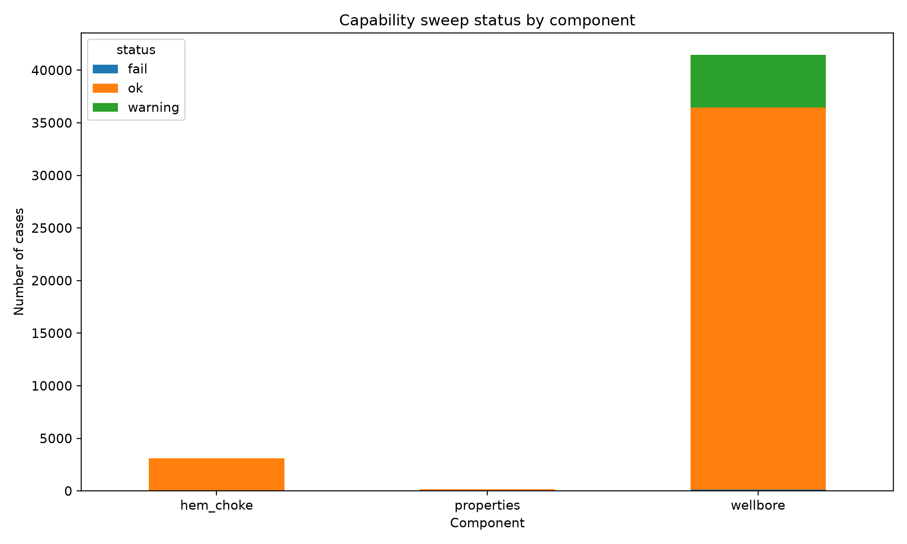
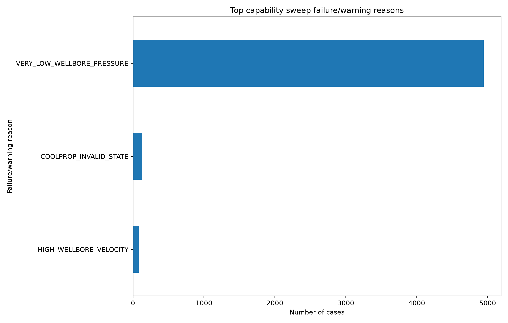
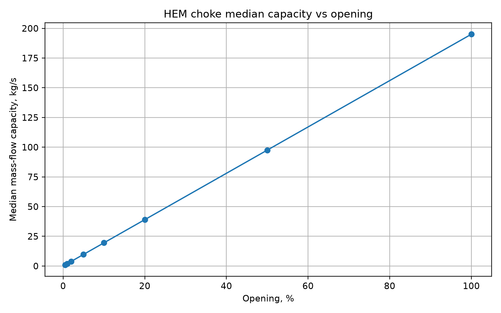
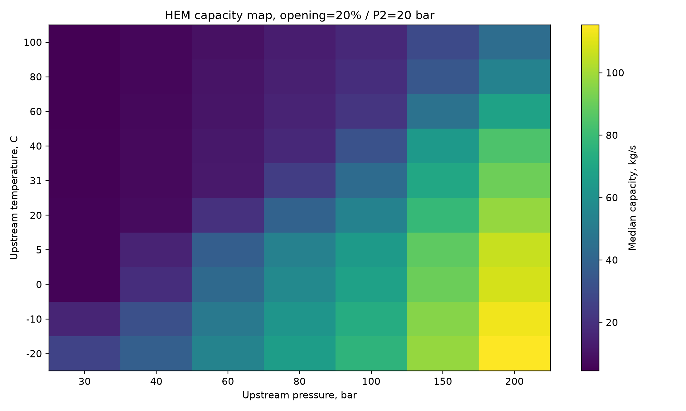
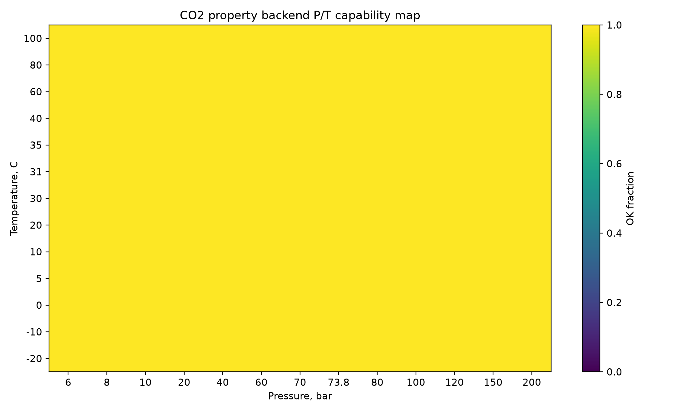
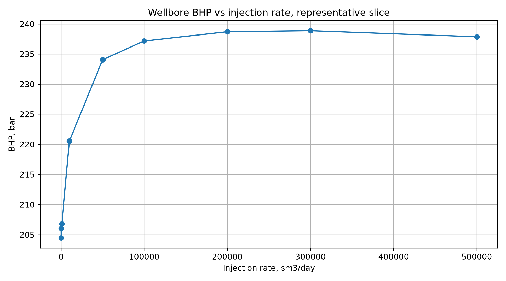
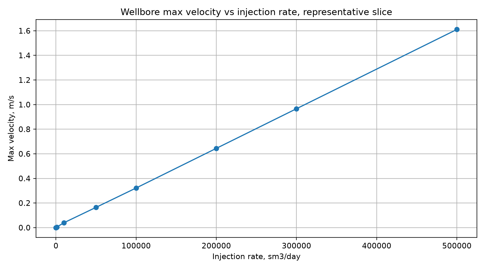

# CO2 Wellbore Coupled Model with OPM Flow

**Version `v0.2.9` — capability envelope and full component stress-test release**

This repository contains a reduced-order external CO2 wellbore/choke workflow designed to be coupled with OPM Flow through restart-based control updates.

The `v0.2.9` release does **not** add salt precipitation or hydrate prediction yet. Instead, it documents the current numerical and physical capability envelope of the CO2 property backend, HEM choke model, and reduced wellbore model before adding new physics.

The main purpose of this release is:

> Stress the current model, identify robust regions, identify warning regions, and document what the model can and cannot safely do before adding salt precipitation and hydrate prediction.

---

## What is new in `v0.2.9`

Version `v0.2.9` adds a full component-level capability sweep and diagnostic plotting layer.

The sweep covers:

* CO2 P/T property calls;
* HEM choke capacity over upstream pressure, upstream temperature, downstream pressure and opening;
* reduced wellbore calculations over THP, injection rate, TVD, tubing diameter, thermal model and segment count;
* failure/warning classification;
* capability figures;
* full-sweep diagnostic tables;
* documented operating-envelope limitations.

Main findings:

* HEM choke behavior is stable and physically monotonic over the tested grid.
* HEM capacity increases with valve opening and upstream pressure.
* HEM capacity decreases with upstream temperature due to lower CO2 density.
* CO2 P/T property calls remain stable over the tested grid.
* The reduced wellbore model identifies a significant warning envelope dominated by `VERY_LOW_WELLBORE_PRESSURE`.
* High-velocity warnings are localized to aggressive high-rate / small-diameter regimes.
* The sweep provides a documented capability boundary before future salt/hydrate modules.

This release does **not** claim:

* salt precipitation prediction;
* hydrate prediction;
* OLGA/PROSPER equivalence;
* field-calibrated predictive accuracy;
* full transient multiphase wellbore validation;
* full validation of OPM Flow itself.

---

## Repository status

The current release should be interpreted as:

| Version  | Purpose                                                           |
| -------- | ----------------------------------------------------------------- |
| `v0.2.8` | Validation and verification of external wellbore/choke components |
| `v0.2.9` | Capability envelope and full component stress-test                |
| future   | Post-choke P-H maps, salt precipitation and hydrate prediction    |

---

## Capability sweep results

The full `v0.2.9` sweep generated component-level results in:

```text
validation/results/capability_envelope.csv
validation/results/capability_summary.md
validation/results/full_tables/
validation/figures_full/
validation/releases/v0.2.9/
```

The capability sweep classifies each case as:

| Status    | Meaning                                                              |
| --------- | -------------------------------------------------------------------- |
| `ok`      | Component returned finite outputs without suspicious diagnostics     |
| `warning` | Component returned outputs, but a diagnostic threshold was triggered |
| `fail`    | Component raised an exception or entered an unsupported state        |

The main warning observed in the full sweep is:

```text
VERY_LOW_WELLBORE_PRESSURE
```

This warning is interpreted as an operating-envelope diagnostic. It identifies combinations of boundary conditions and geometry where the reduced wellbore model approaches very low internal pressure and should not be treated as a fully reliable operating point without additional checks.

---

## Capability figures

### Full sweep status

The full sweep identifies mostly stable behavior for the HEM choke and property backend, while the wellbore model exposes a clear warning envelope.



The dominant warning reason is `VERY_LOW_WELLBORE_PRESSURE`.



---

## HEM choke capability

The HEM choke model shows physically reasonable behavior over the tested pressure, temperature, downstream pressure and opening ranges.

Capacity increases monotonically with valve opening:



The HEM capacity map shows higher capacity at higher upstream pressure and lower upstream temperature:



This behavior is consistent with real-fluid CO2 density effects: colder and denser CO2 produces higher mass-flow capacity.

---

## CO2 property backend capability

The CO2 P/T property backend remains stable over the tested P/T grid:



This is a useful property sanity check, but it is not a complete post-choke P-H validation. Future releases should add dedicated post-choke P-H maps for temperature, density, quality and hydrate-risk proxy diagnostics.

---

## Wellbore capability

The reduced wellbore model was stressed over injection rate, THP, TVD, diameter, thermal model and segment count.

A representative BHP response shows the expected increase with injection rate, followed by a near-plateau at high rates:



The velocity response increases approximately linearly with injection rate:



The wellbore warning envelope is dominated by very low internal pressure in aggressive or unrealistic operating regimes. This is the main practical boundary identified by the `v0.2.9` sweep.

---

## How to run the capability sweep

For a fast smoke check:

```bash
python scripts/stress/run_capability_sweep.py --mode smoke
python scripts/stress/plot_capability_results.py
```

For the recommended quick capability check:

```bash
python scripts/stress/run_capability_sweep.py --mode quick 2>&1 | tee capability_quick.log
python scripts/stress/plot_capability_results.py \
  --csv validation/results/capability_envelope.csv \
  --figures-dir validation/figures_quick \
  --tables-dir validation/results/quick_tables
```

For the full component-level stress sweep:

```bash
time python scripts/stress/run_capability_sweep.py --mode full 2>&1 | tee capability_full.log
python scripts/stress/plot_capability_results.py \
  --csv validation/results/capability_envelope.csv \
  --figures-dir validation/figures_full \
  --tables-dir validation/results/full_tables
```

The full sweep can take several hours depending on the machine and the selected grid.

---

## Generated outputs

Typical full-sweep outputs include:

```text
validation/results/capability_envelope.csv
validation/results/capability_summary.md
validation/results/full_tables/
validation/figures_full/capability_status_by_component.png
validation/figures_full/capability_failure_reasons.png
validation/figures_full/capability_hem_capacity_vs_opening.png
validation/figures_full/capability_hem_capacity_map_p1_t1.png
validation/figures_full/capability_property_pt_ok_map.png
validation/figures_full/capability_wellbore_bhp_vs_rate.png
validation/figures_full/capability_wellbore_velocity_vs_rate.png
```

---

## Installation

Install the package in editable mode:

```bash
pip install -e ".[dev]"
```

Run a quick syntax check:

```bash
python -m py_compile \
  scripts/stress/run_capability_sweep.py \
  scripts/stress/plot_capability_results.py \
  src/co2_wellbore/coupling/cli.py
```

Run the smoke capability test:

```bash
pytest -q tests/test_capability_sweep.py
```

---

## OPM Flow coupling

The package is designed to support restart-based coupling with OPM Flow. OPM Flow itself is treated as an external simulator. The validation and capability claims in this release apply to the external reduced-order wellbore/choke components and the surrounding coupling workflow, not to a re-validation of OPM Flow.

A typical coupled example uses:

```bash
python -m co2_wellbore.coupling.opm_restart \
  --run-flow \
  --deck Base.DATA \
  --case-id CASE_ID \
  --pressure-control-mode opening_choke \
  --choke-model hem \
  --thermal-model layered
```

See the `examples/` directory for runnable scripts.

---

## Scientific scope

This project currently provides a reduced-order engineering model for CO2 wellbore/choke coupling studies.

The current model includes:

* CO2 property evaluation through CoolProp;
* reduced 1D wellbore pressure and thermal calculations;
* optional drift-flux treatment for saturated CO2 states;
* real-fluid HEM choke capacity calculation;
* restart-based coupling workflow with OPM Flow;
* validation and capability sweep utilities.

The current model does not include:

* salt precipitation;
* hydrate prediction;
* compositional brine chemistry;
* full transient multiphase wellbore PDEs;
* field-calibrated model parameters;
* commercial simulator equivalence claims.

---

## Recommended interpretation of `v0.2.9`

The `v0.2.9` release should be used as a documented baseline before adding salt precipitation and hydrate prediction.

The correct interpretation is:

> The model has a documented component-level capability envelope. HEM choke and CO2 P/T property behavior are robust over the tested grid. The wellbore model identifies clear warning regions, especially very-low-pressure regimes, which should be treated as outside or near the edge of the recommended operating envelope.

The incorrect interpretation is:

> The model is fully validated for all CO2 injection scenarios, salt precipitation and hydrate risk.

---

## Next development steps

Recommended next steps after `v0.2.9`:

1. Add post-choke P-H stress maps:

   * post-choke temperature;
   * post-choke density;
   * post-choke quality;
   * post-choke cooling maps.

2. Add hydrate-risk proxy diagnostics, clearly marked as non-predictive.

3. Add salt precipitation pre-screening only after the post-choke thermodynamic envelope is understood.

4. Add operating-envelope tables:

   * maximum safe rate versus THP/TVD/diameter;
   * low-pressure warning boundaries;
   * high-velocity warning boundaries.

5. Add optional OPM integration regression tests.

---

## Citation / acknowledgement

This repository is part of ongoing research on CO2 injection wellbore/reservoir coupling and reduced-order surrogate workflows using OPM Flow.

For scientific use, please cite the repository version/tag used in your experiments.

