# CO₂ Wellbore–Reservoir Coupling

**Version `v0.2.8` — wellbore/choke validation and verification release**

This repository implements a Python-based reduced-order CO₂ wellbore and HEM choke model coupled to OPM Flow through a restart-based workflow.

The project is intended for research on CO₂ injection control, wellbore–reservoir coupling, choke-limited injection, thermal feedback through `WTEMP`, and reproducible coupling diagnostics.

> **Scope note:** `v0.2.8` validates and verifies the **external reduced-order CO₂ wellbore and HEM choke components**.  
> The OPM Flow reservoir simulator is treated as an external simulator and is **not revalidated** in this repository.

---

## What is new in `v0.2.8`

Version `v0.2.8` adds a visible validation and verification layer for the wellbore/choke model:

- CO₂ property checks against frozen NIST WebBook reference points;
- CO₂ density and enthalpy trend verification;
- tiny-flow hydrostatic wellbore pressure limiting case;
- reduced thermal-model heat-transfer limiting behavior;
- HEM choke capacity response to opening;
- HEM choked and subcritical flow behavior;
- HEM ideal-gas limiting behavior;
- HEM critical-pressure and capacity numerical robustness.

This release is designed to make the model easier to assess scientifically, not just operationally.

---

## Repository structure

```text
co2-wellbore/
├── src/co2_wellbore/
│   ├── calculator.py              # 1D CO₂ wellbore pressure/thermal model
│   ├── hem_choke.py               # Real-fluid HEM choke model
│   ├── properties.py              # CoolProp CO₂ property wrapper
│   └── coupling/                  # OPM Flow restart-based coupling workflow
├── data/                          # Example OPM deck and include files
├── examples/                      # Example coupling runners
├── tests/                         # Unit and validation tests
├── scripts/validation/            # Reproducible validation figure generators
├── validation/
│   ├── reference/                 # Frozen external reference data
│   ├── figures/                   # Generated validation figures
│   └── results/                   # Generated validation CSV tables
├── VALIDATION.md                  # Validation scope and methodology
└── README.md
```

---

## Installation

From the repository root:

```bash
pip install -e ".[dev]"
```

The package depends on `numpy`, `pandas`, `CoolProp`, `matplotlib`, `scipy`, and `pytest` for tests.

---

## Quick checks

Run the full test suite:

```bash
pytest -q
```

Run only the validation tests:

```bash
pytest -q tests/validation
```

Run the validation scripts:

```bash
./scripts/validation/run_validation_suite.sh
```

Or run the figure generators individually:

```bash
python scripts/validation/generate_validation_figures.py
python scripts/validation/generate_hem_ideal_gas_limit.py
python scripts/validation/generate_property_reference_comparison.py
```

Generated figures are written to:

```text
validation/figures/
```

Generated numerical tables are written to:

```text
validation/results/
```

---

# Validation and verification evidence in `v0.2.8`

The following figures are intentionally shown on the main project page so that the validation evidence is visible immediately on GitHub.

## 1. CO₂ property verification

### CO₂ density trend

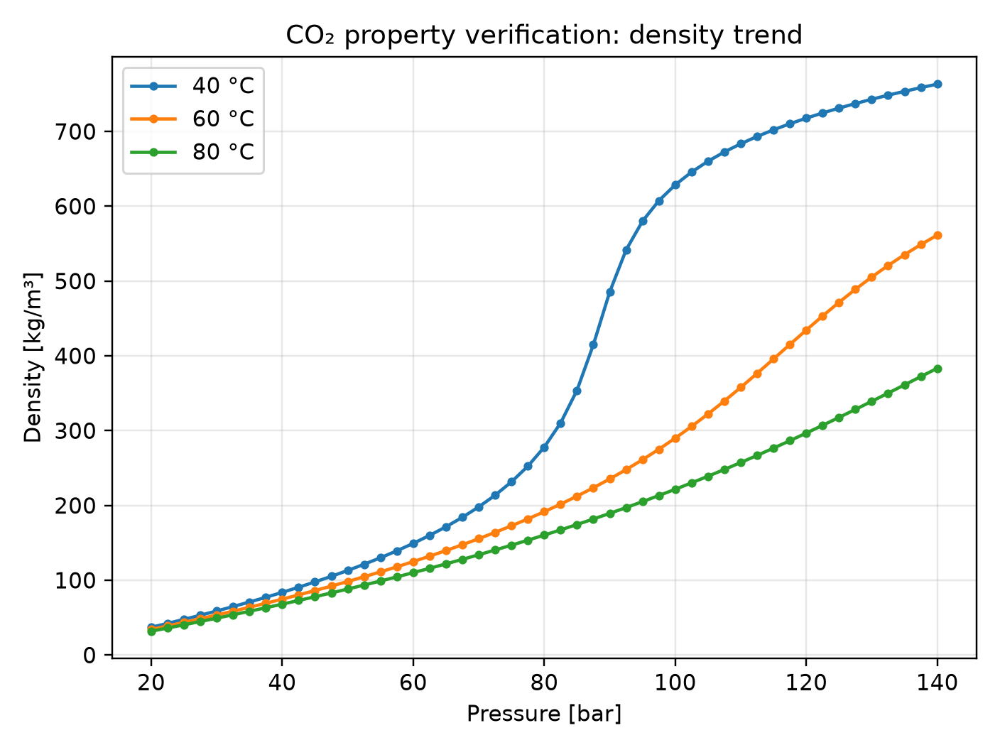

The density increases with pressure at fixed temperature. The steep increase at lower temperature reflects the transition toward dense/supercritical-like CO₂ behavior.

### CO₂ enthalpy trend

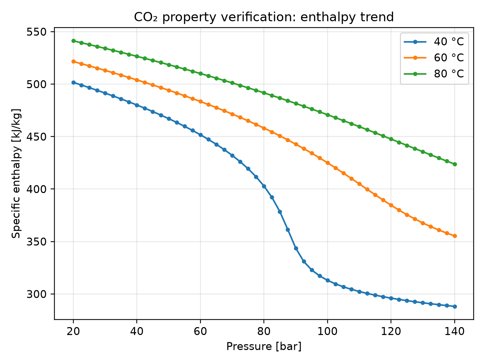

The specific enthalpy decreases smoothly with pressure at fixed temperature. This verifies stable property evaluation over the tested pressure range.

### Frozen NIST reference comparison

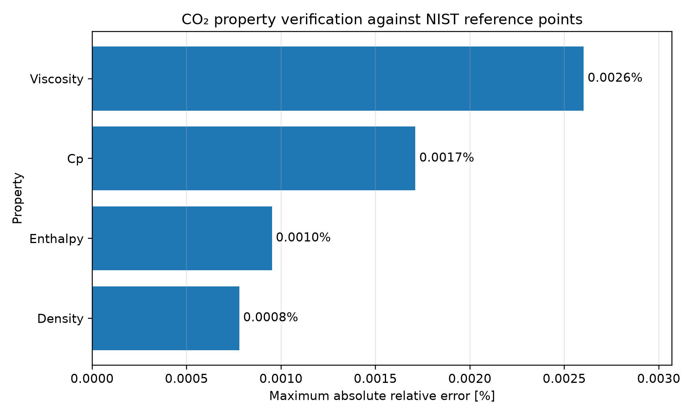

Frozen NIST WebBook reference points are used for density, enthalpy, viscosity, and heat capacity.

For the selected reference states, the maximum relative errors are below `0.003%`.

The reference CSV is stored in:

```text
validation/reference/co2_nist_reference_points.csv
```

The comparison results are stored in:

```text
validation/results/co2_reference_property_comparison.csv
validation/results/co2_reference_property_error_summary.csv
```

Additional parity plots are generated for each property:

```text
validation/figures/co2_reference_density_kg_m3_parity.png
validation/figures/co2_reference_enthalpy_J_kg_parity.png
validation/figures/co2_reference_viscosity_Pa_s_parity.png
validation/figures/co2_reference_cp_J_kgK_parity.png
```

---

## 2. Wellbore pressure verification

### Tiny-flow hydrostatic limit

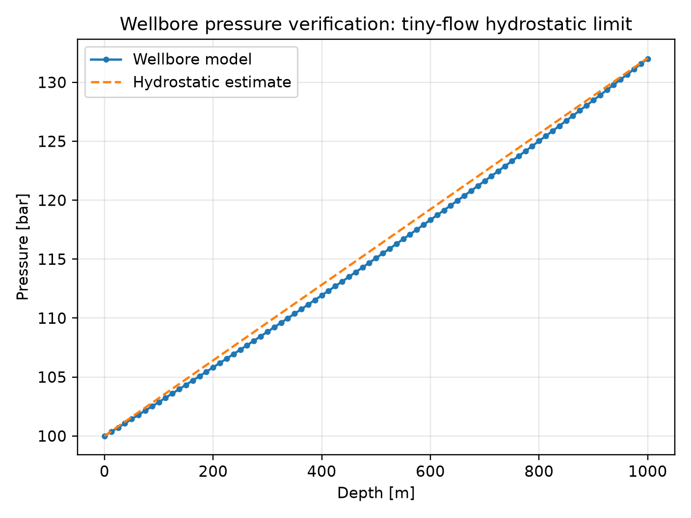

At tiny flow rate, friction and acceleration effects are small. The computed wellbore pressure profile closely follows the hydrostatic pressure estimate.

This verifies that the pressure integration behaves correctly in a simple analytical limiting case.

---

## 3. Reduced thermal-model verification

### Heat-transfer response

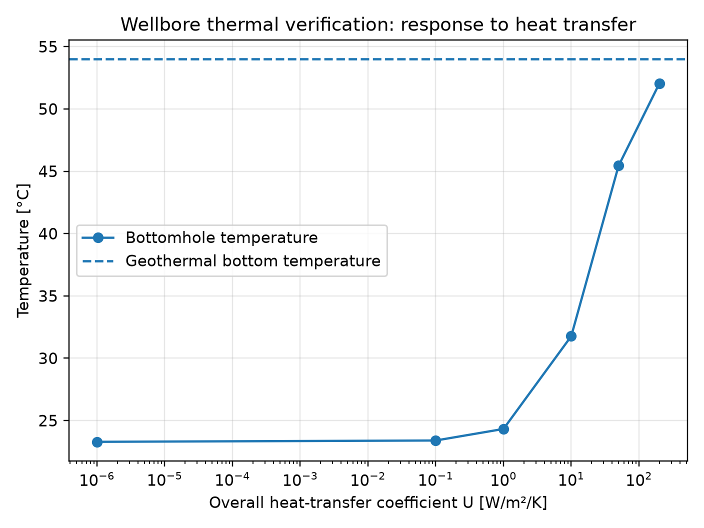

As the heat-transfer coefficient increases, the bottomhole temperature moves toward the geothermal bottomhole temperature.

This verifies the limiting behavior of the reduced thermal model.

> This figure does **not** claim full transient thermal-physics validation.  
> It verifies that the reduced engineering thermal model responds in the physically expected direction.

---

## 4. HEM choke verification

### Capacity response to choke opening

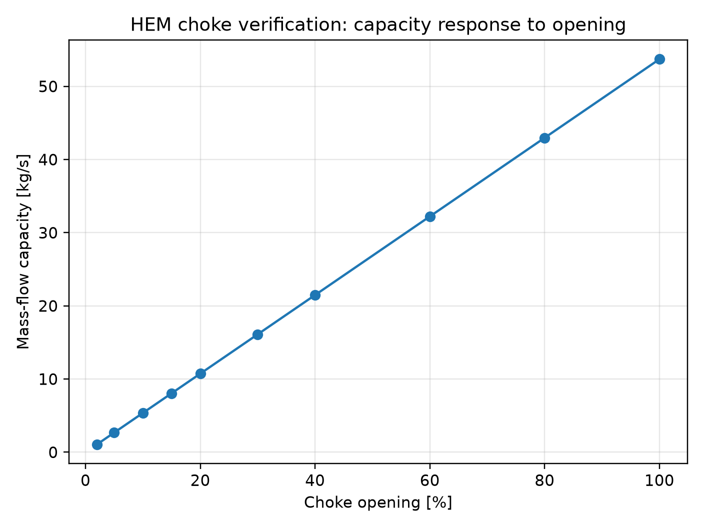

The HEM choke capacity increases monotonically with choke opening.

This verifies the expected physical response of the effective choke area.

### Choked and subcritical regimes

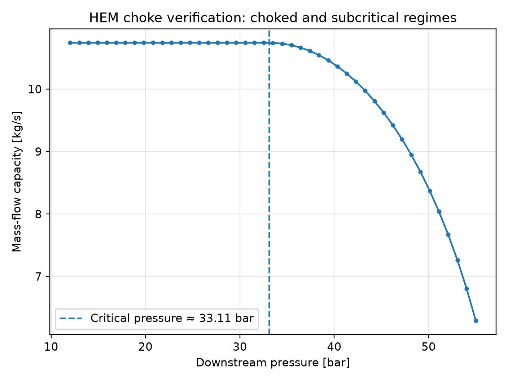

The model reproduces two expected regimes:

- below the critical pressure, the flow is choked and capacity is nearly independent of downstream pressure;
- above the critical pressure, the flow becomes subcritical and capacity decreases with increasing downstream pressure.

### Ideal-gas limiting behavior

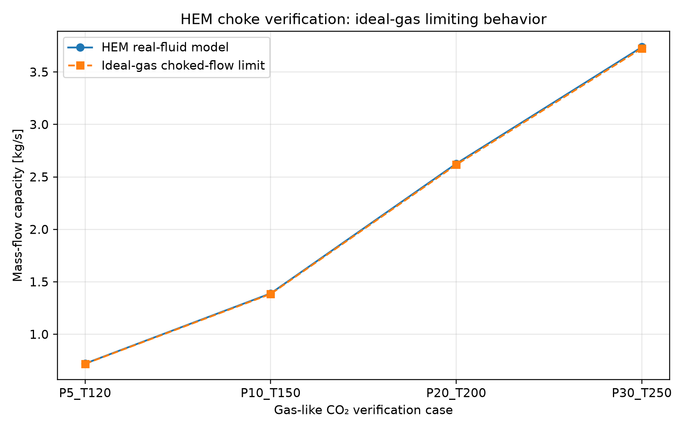

In gas-like CO₂ states, the real-fluid HEM implementation approaches the analytical ideal-gas choked-flow limit.

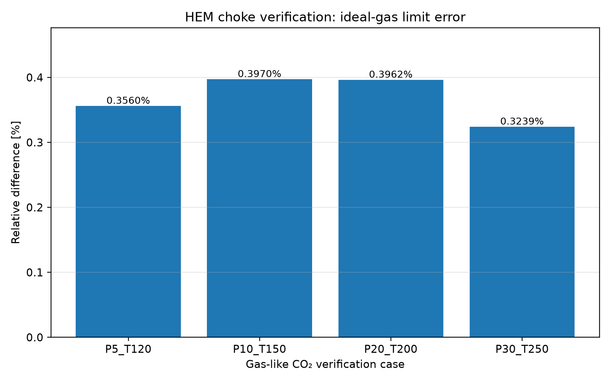

The relative difference from the analytical ideal-gas limit is about `0.3–0.4%` for the selected gas-like CO₂ cases.

---

## 5. HEM critical-pressure numerical robustness

### Critical-pressure robustness

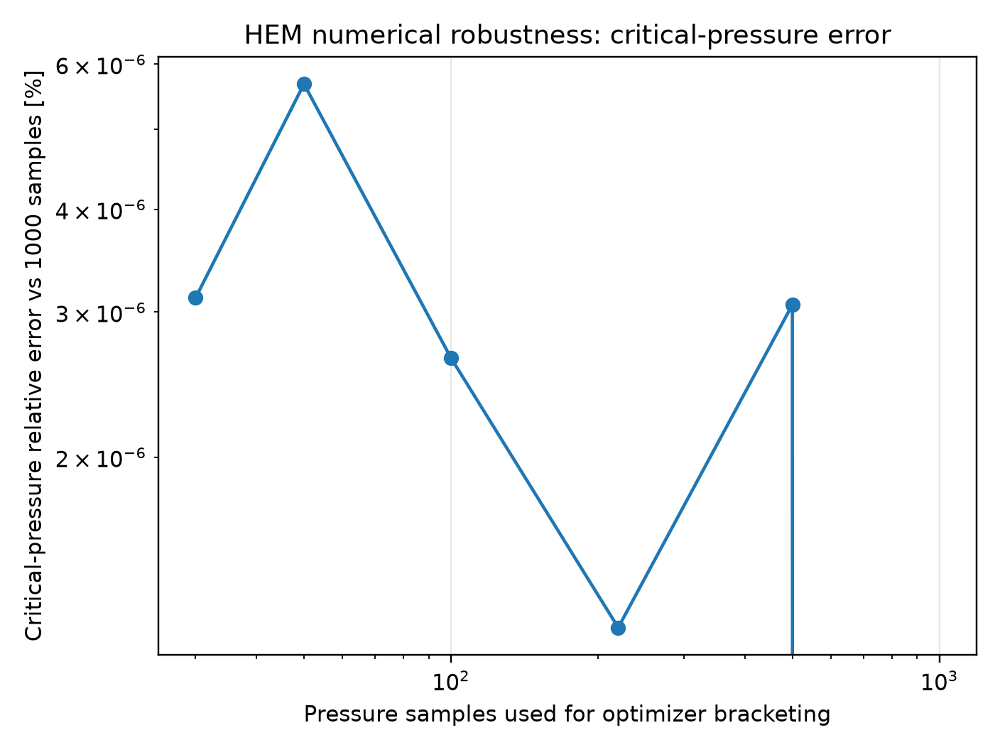

### Capacity robustness

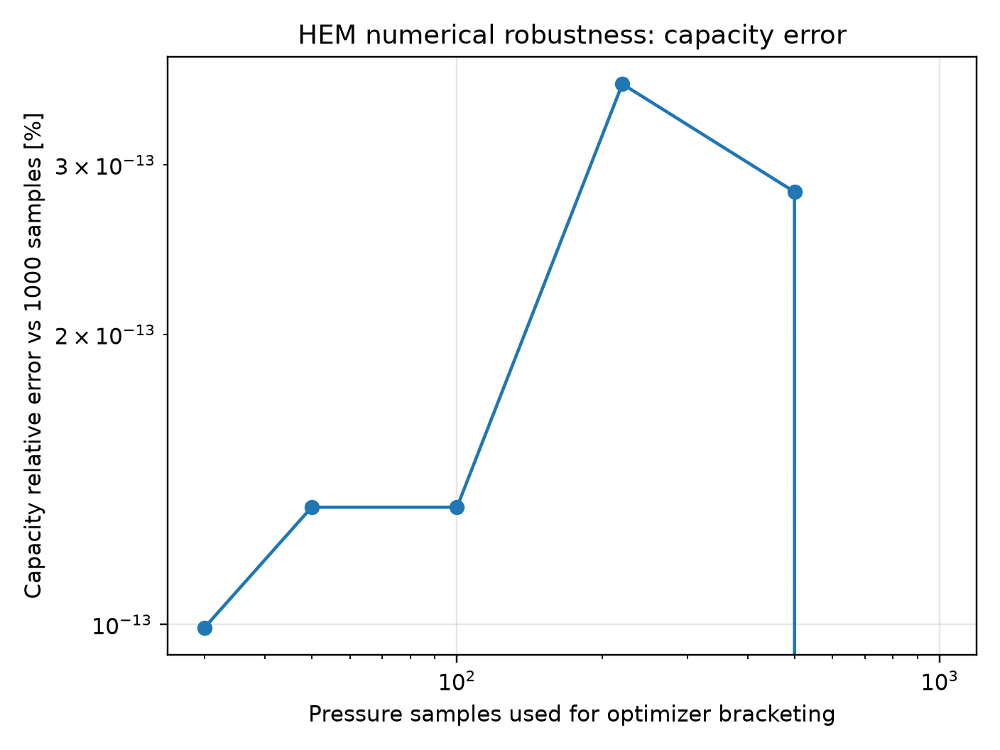

The HEM critical pressure is no longer selected only as the maximum point from a fixed pressure grid.

In `v0.2.8`, the algorithm uses:

1. a log-spaced pressure grid to locate a robust bracket;
2. bounded scalar optimization in log-pressure space to refine the critical point;
3. the original grid result as fallback if the optimizer fails or enters an invalid thermodynamic state.

The resulting critical pressure and capacity are insensitive to the optimizer-bracketing grid resolution for the tested case.

---

# Main validation summary

| Component | Verification evidence | Result |
|---|---|---|
| CO₂ properties | Frozen NIST WebBook reference points | Maximum selected-property error below `0.003%` |
| CO₂ property trends | Density and enthalpy over pressure | Smooth physically consistent trends |
| Wellbore pressure | Tiny-flow hydrostatic limit | Computed pressure closely follows hydrostatic estimate |
| Reduced thermal model | Heat-transfer response | Bottomhole temperature approaches geothermal limit as `U` increases |
| HEM opening response | Capacity versus choke opening | Capacity increases monotonically with opening |
| HEM critical flow | Capacity versus downstream pressure | Choked plateau and subcritical decline reproduced |
| HEM analytical limit | Ideal-gas choked-flow comparison | Agreement within about `0.4%` in gas-like CO₂ cases |
| HEM numerics | Optimizer-bracketing grid sensitivity | Capacity and critical pressure insensitive to bracketing resolution |

---

## Scientific claim

The correct scientific claim for `v0.2.8` is:

> The reduced-order CO₂ wellbore and HEM choke components are verified against thermodynamic reference points, analytical limiting cases, monotonicity checks, choked-flow behavior, ideal-gas limiting behavior, and numerical robustness tests.

This repository does **not** claim:

- validation of OPM Flow itself;
- equivalence to OLGA or PROSPER;
- field-calibrated predictive wellbore performance;
- full transient multiphase wellbore PDE validation.

---

## Coupling model overview

The coupling workflow links OPM Flow and the external wellbore/choke model through restart-based control.

At each coupling step, the workflow uses OPM trial information and external wellbore/choke calculations to update injection control quantities such as:

- injection rate;
- wellbore bottomhole pressure;
- tubing-head/choke behavior;
- bottomhole temperature feedback through `WTEMP`.

The thermal deck editing workflow keeps `TEMPVD` as the fixed geothermal reservoir initialization and updates `WTEMP` as the wellbore-calculated injection temperature.

This avoids resetting the reservoir thermal field while still allowing the external wellbore model to provide thermal feedback at the well.

---

## Canonical validation commands

From the repository root:

```bash
pip install -e ".[dev]"
python -m compileall src
pytest -q
pytest -q tests/validation
./scripts/validation/run_validation_suite.sh
```

Expected state for `v0.2.8`:

```text
all tests passing
validation figures generated in validation/figures/
validation CSV tables generated in validation/results/
```

---

## Recommended use in papers or thesis text

Recommended wording:

> A restart-based research coupling workflow is developed between OPM Flow and an external reduced-order CO₂ wellbore/choke model. The external model uses CoolProp real-fluid properties, a 1D wellbore pressure/thermal calculation, and a real-fluid HEM choke capacity model. The wellbore and choke components are verified against frozen thermodynamic reference points, analytical limiting cases, monotonicity checks, choked-flow behavior, ideal-gas limiting behavior, and numerical robustness tests. The reservoir simulator itself is treated as an external component and is not revalidated in this work.

Avoid claiming:

```text
The full coupled simulator is fully validated against commercial wellbore simulators.
```

A stronger and more defensible claim is:

```text
The reduced-order wellbore/choke components are verified and documented through reproducible validation tests and figures.
```

---

## Development notes

Useful commands:

```bash
python -m compileall src
pytest -q
pytest -q tests/validation
python scripts/validation/run_hem_grid_convergence.py
```

Generate validation figures:

```bash
python scripts/validation/generate_validation_figures.py
python scripts/validation/generate_hem_ideal_gas_limit.py
python scripts/validation/generate_property_reference_comparison.py
```

---

## License and data

The repository uses open Python tooling and frozen local validation reference points.

The NIST WebBook-derived reference values are stored as fixed CSV values to keep the validation suite reproducible offline. The validation scripts do not download live web data during CI or local test runs.
